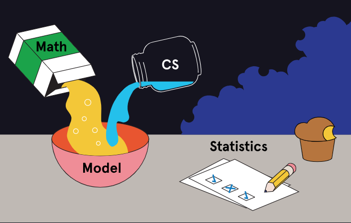

# MLE_start

## 5 skill tracks 

### Introduction (Введения)

### Machine Learning Fundamentals (Фундамент)

### Software Engineering for MLE's (Инженер ПО)

### Intermediate Machine Learning (От Джуниора к Миддле)

### Building Machine Learning Pipelines (Пайплайны)

``` Here we go ```

## 1. Введения



Машинное обучения это термин обозначающий алгоритм которое анализирует данные и находить паттерны в исторических данных. Чтобы делать прогнозы на основе новых/неизвестных данных.

Тогда какая разница между Data Science, Data Engineer & Machine Learning Engineer?


